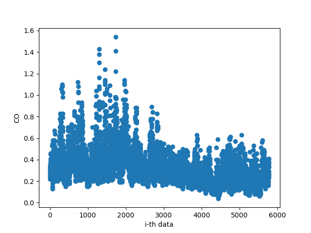
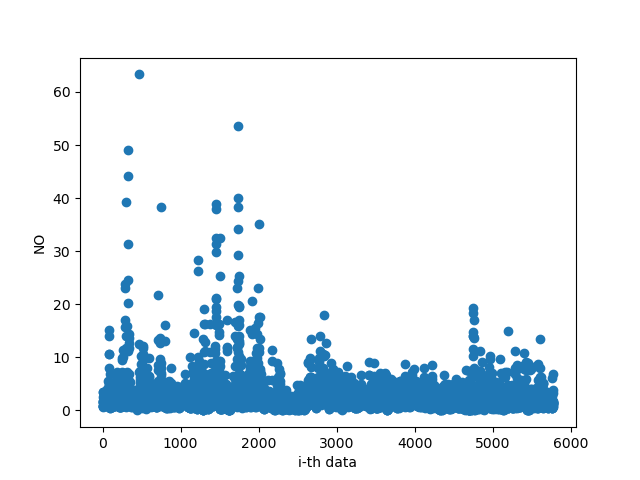
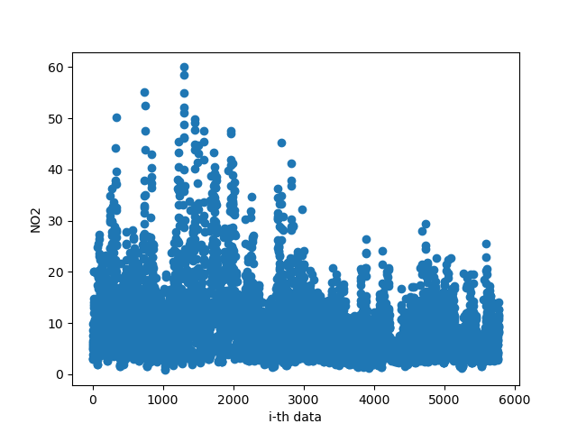
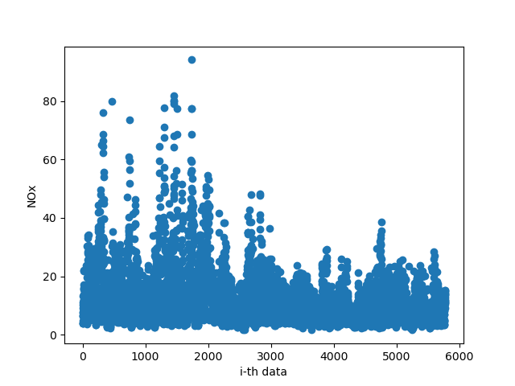
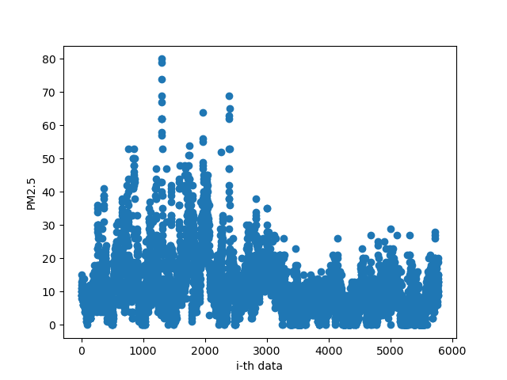

# Machine Learning Homework

## How to choose features of data
* After observing the training data visualized image, you can be aware of the relationship between the PM2.5 feature and the others.

For instance, the CO image, NO image, NO2 image, and NOx image are much more correlated with PM2.5.

* I also choose PM10, WS_HR, RAINFALL, RH,  WIND_SPEED, and PM2.5 which you can see [here](/HW1/Programming/train_data_img/)

## Hyperparameter and Preprocessing
* All my testing config can be found [here](/HW1/Programming/Training Result.xlsx)
* I used a filter to choose valid data and set a threshold by observing the visualized figure of all features.

## My takeaway
* Using normalization is not like what I thought. Practically speaking, using normalization can gather all data to a specific area that the model can converge much more rapidly. But, in this case, the result is worse and also appear negative value of the PM2.5 result. According to [this page](https://blog.csdn.net/u010947534/article/details/86632819?spm=1001.2014.3001.5506), maybe the normalization method is not suitable in my case.
* I also figured that using the stored weight and bias by my pretrained model is not the right way. I used pickle to store the dump parameters during the training and used the best one as my pretrained parameter. But it's still not that good enough.
* The better way in this project to enhance your accuracy is tuning your training config and select  good features.